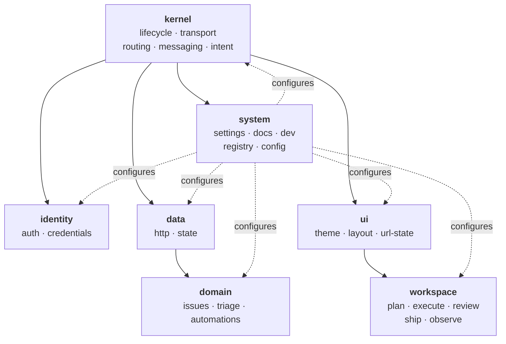
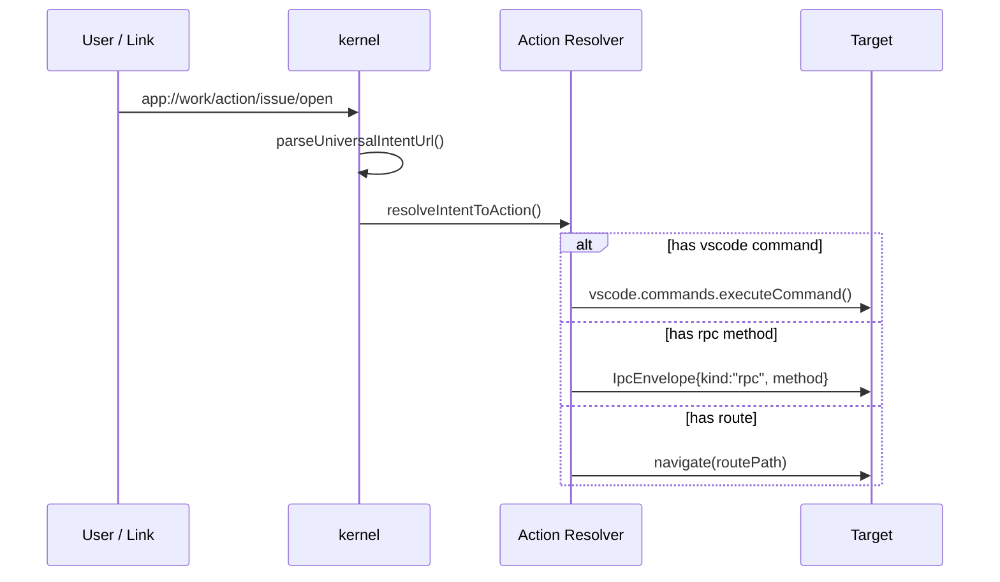
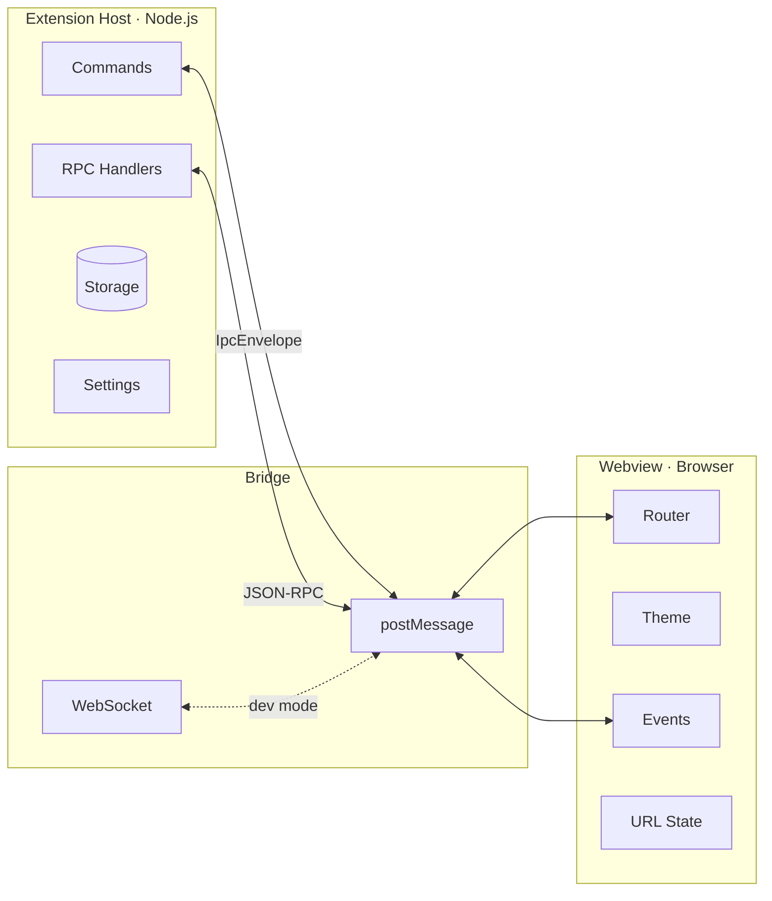
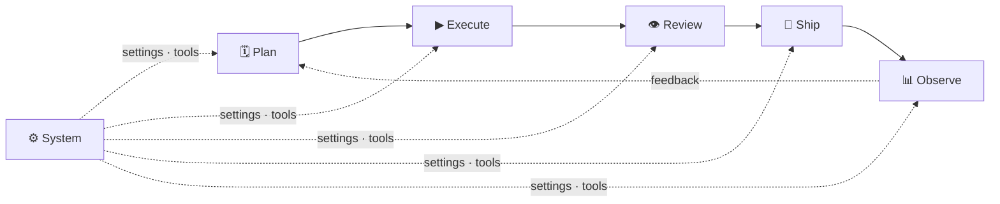
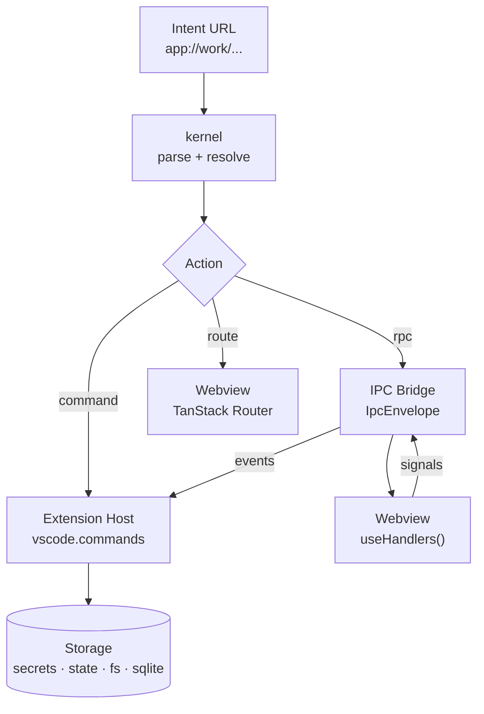
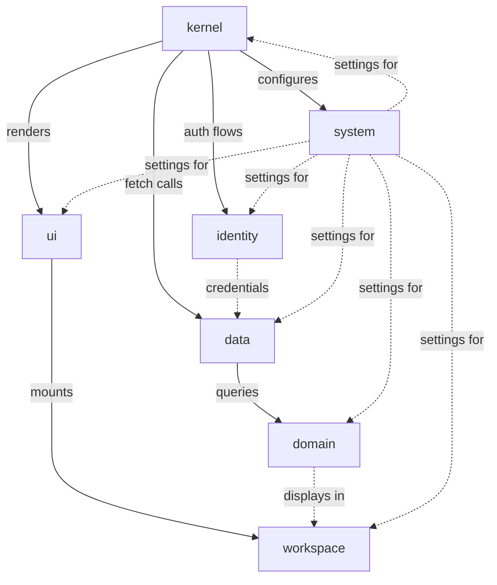

# App Surface Matrix

*Auto-generated by `bun run scripts/generate-matrix.ts` — do not edit manually.*


Generated: 2026-02-20


## Topology

7 canonical **spaces** organize all app surfaces into a consistent, navigable architecture.




| Space | Concern | Surfaces |
| --- | --- | --- |
| **Kernel** | Runtime primitives | 27 (1 routes, 8 cmds, 9 rpc, 5 actions, 4 events) |
| **Identity** | Authentication, credentials, accounts | 9 (2 cmds, 2 rpc, 2 actions, 3 settings) |
| **Data** | External I/O — HTTP client, state queries | 4 (4 rpc) |
| **Domain** | Business logic — issues, triage, automations | 11 (1 cmds, 7 rpc, 3 settings) |
| **UI** | Presentation — theme, layout, URL state | 3 (3 rpc) |
| **Workspace** | Stage feature views — plan, execute, review, ship, observe | 10 (10 routes) |
| **System** | Meta — settings, docs, registry, dev tools, configuration | 30 (3 routes, 5 cmds, 11 rpc, 8 actions, 3 settings) |

## Grammar

The vocabulary of the app surface system:


| Term | Definition | Example |
| --- | --- | --- |
| **Space** | A bounded functionality domain | `kernel`, `workspace`, `system` |
| **Intent** | A canonical meaning URL (`app://`). | `app://work/route/plan` |
| **Action** | A resolved intent with concrete effect target(s) | `{ id: "work.identity.login", vscode: "work.login" }` |
| **Envelope** | Transport-agnostic message wrapper | `{ kind: "rpc", method: "getIssue" }` |
| **Route** | A navigation target in the webview router | `{ path: "/plan", stage: "plan" }` |
| **Command** | An imperative operation on the extension host | `work.openApp` |
| **RPC** | A request/response method across the IPC bridge | `getIssue` → `IpcEnvelope{kind:"rpc"}` |
| **Signal** | An observable event emitted from webview | `work.webview.ready` |
| **Setting** | A typed configuration knob with env-key binding | `work.baseUrl` → `WORKSPACE_BASE_URL` |
| **Storage** | A persistence target with kind + scope | `{ id: "secrets", kind: "secrets", scope: "global" }` |
| **Stage** | A lifecycle phase in the workspace | `plan → execute → review → ship → observe` |

## Naming Conventions

Consistent `<space>.<noun>.<verb>` pattern:


```

Commands:  work.<space>.<noun>.<verb>     e.g. work.kernel.app.open

Actions:   work.<space>.<noun>.<verb>     e.g. work.identity.login

RPC:       <space>.<noun>.<verb>               e.g. domain.issue.get

Events:    work.<noun>.<event>             e.g. work.webview.ready

Settings:  work.<key>                      e.g. work.baseUrl

Routes:    /<stage>/<sub>                       e.g. /plan/weekly

Intents:   app://work/<kind>/<path>        e.g. app://work/route/plan

```


### Proposed Renames (sample)

| Current | Proposed | Space |
| --- | --- | --- |
| `work.openApp` | `work.kernel.app.open` | kernel |
| `work.refresh` | `work.kernel.app.refresh` | kernel |
| `showInformation` | `kernel.app.showInformation` | kernel |
| `execCommand` | `kernel.app.execCommand` | kernel |
| `getState` | `kernel.app.getState` | kernel |
| `registerChannel` | `kernel.messaging.register` | kernel |
| `sendMessage` | `kernel.messaging.send` | kernel |
| `work.login` | `work.identity.login` | identity |
| `work.logout` | `work.identity.logout` | identity |
| `saveApiToken` | `identity.token.save` | identity |
| `disconnect` | `identity.disconnect` | identity |
| `axiosGet` | `data.http.get` | data |
| `axiosPost` | `data.http.post` | data |
| `work.openIssue` | `work.domain.issue.open` | domain |
| `getIssue` | `domain.issue.get` | domain |
| `listIssues` | `domain.issue.list` | domain |
| `runTriage` | `domain.triage.run` | domain |
| `getAutomations` | `domain.automation.list` | domain |
| `getTheme` | `ui.theme.get` | ui |
| `setTheme` | `ui.theme.set` | ui |
| `openSettings` | `system.settings.open` | system |
| `work.runDevWebview` | `work.system.dev.runWebview` | system |
| `getDocsIndex` | `system.docs.getIndex` | system |
| `getUniversalConfig` | `system.config.get` | system |

## Current → Coalesced Mapping

18 current modules → 7 canonical spaces:


| Current Module | → Space | Surfaces |
| --- | --- | --- |
| `app` | **Kernel** | 1 routes, 8 cmds, 4 rpc, 5 actions, 4 events |
| `config` | **Kernel** | - |
| `messages` | **Kernel** | 5 rpc |
| `auth` | **Identity** | 2 cmds, 2 rpc, 2 actions, 3 settings |
| `http` | **Data** | 4 rpc |
| `issues` | **Domain** | 1 cmds, 3 rpc, 3 settings |
| `triage` | **Domain** | 2 rpc |
| `automations` | **Domain** | 2 rpc |
| `theme` | **UI** | 3 rpc |
| `plan` | **Workspace** | 5 routes |
| `execute` | **Workspace** | 1 routes |
| `review` | **Workspace** | 2 routes |
| `ship` | **Workspace** | 1 routes |
| `observe` | **Workspace** | 1 routes |
| `system` | **System** | 3 routes |
| `settings` | **System** | 1 rpc, 1 actions |
| `docs` | **System** | 3 rpc, 1 settings |
| `dev` | **System** | 5 cmds, 6 rpc, 6 actions, 2 settings |
| `universal` | **System** | 1 rpc, 1 actions |

## Space: Kernel (27 surfaces)

*Runtime primitives*


Modules: `app`, `config`, `messages`


### Routes

| ID | Path | Stage | Tab |
| --- | --- | --- | --- |
| `appDispatch` | `/app/$` | - | hidden |

### Commands

| Key | Command ID |
| --- | --- |
| `OPEN_APP` | `work.openApp` |
| `REFRESH` | `work.refresh` |
| `REFRESH_STORY_TASKS` | `work.refreshStoryTasks` |
| `START_TASK_TERMINAL` | `work.startTaskTerminal` |
| `OPEN_AGENT_CHAT` | `work.openAgentChat` |
| `ATTACH_AGENT_SESSION` | `work.attachAgentSession` |
| `START_STORY_AGENT` | `work.startStoryAgent` |
| `NEW_STORY_AGENT` | `work.newStoryAgent` |

### RPC Methods

| Method | Has Action |
| --- | --- |
| `showInformation` | orphan |
| `execCommand` | orphan |
| `onDidOpenTextDocument` | orphan |
| `getState` | orphan |
| `registerChannel` | orphan |
| `unregisterChannel` | orphan |
| `sendMessage` | orphan |
| `addMessageListener` | orphan |
| `rmMessageListener` | orphan |

### Actions

| Action ID | Route | VS Code Cmd | RPC |
| --- | --- | --- | --- |
| `work.app.open` | `plan` | `work.openApp` | - |
| `work.app.login` | `systemSettings` | `work.login` | - |
| `work.app.logout` | - | `work.logout` | - |
| `work.app.refresh` | - | `work.refresh` | - |
| `work.app.refreshStoryTasks` | - | `work.refreshStoryTasks` | - |

### Signals

| Event ID | Direction |
| --- | --- |
| `work.webview.ready` | webview → ext |
| `work.route.changed` | webview → ext |
| `work.ui.action` | webview → ext |
| `work.ui.event` | webview → ext |

## Space: Identity (9 surfaces)

*Authentication, credentials, accounts*


Modules: `auth`


### Commands

| Key | Command ID |
| --- | --- |
| `LOGIN` | `work.login` |
| `LOGOUT` | `work.logout` |

### RPC Methods

| Method | Has Action |
| --- | --- |
| `saveApiToken` | yes |
| `disconnect` | yes |

### Actions

| Action ID | Route | VS Code Cmd | RPC |
| --- | --- | --- | --- |
| `work.auth.saveApiToken` | - | - | `saveApiToken` |
| `work.auth.disconnect` | - | - | `disconnect` |

### Settings

| Setting | Type | Sensitive | Env Keys |
| --- | --- | --- | --- |
| `work.baseUrl` | string | - | - |
| `work.email` | string | - | - |
| `work.apiToken` | string | yes | - |

## Space: Data (4 surfaces)

*External I/O — HTTP client, state queries*


Modules: `http`


### RPC Methods

| Method | Has Action |
| --- | --- |
| `axiosGet` | orphan |
| `axiosPost` | orphan |
| `axiosPut` | orphan |
| `axiosDelete` | orphan |

## Space: Domain (11 surfaces)

*Business logic — issues, triage, automations*


Modules: `issues`, `triage`, `automations`


### Commands

| Key | Command ID |
| --- | --- |
| `OPEN_ISSUE` | `work.openIssue` |

### RPC Methods

| Method | Has Action |
| --- | --- |
| `getIssue` | orphan |
| `listIssues` | orphan |
| `openIssueInBrowser` | yes |
| `getTriageState` | orphan |
| `runTriage` | orphan |
| `getAutomations` | orphan |
| `getAutomationRuns` | orphan |

### Settings

| Setting | Type | Sensitive | Env Keys |
| --- | --- | --- | --- |
| `work.jiraUrl` | string | - | `JIRA_URL`, `BASE_URL` |
| `work.jql` | string | - | `JIRA_JQL` |
| `work.maxResults` | number | - | - |

## Space: UI (3 surfaces)

*Presentation — theme, layout, URL state*


Modules: `theme`


### RPC Methods

| Method | Has Action |
| --- | --- |
| `getTheme` | orphan |
| `setTheme` | orphan |
| `onThemeChange` | orphan |

## Space: Workspace (10 surfaces)

*Stage feature views — plan, execute, review, ship, observe*


Modules: `plan`, `execute`, `review`, `ship`, `observe`


### Routes

| ID | Path | Stage | Tab |
| --- | --- | --- | --- |
| `plan` | `/plan` | plan | Daily |
| `planWeekly` | `/plan/weekly` | plan | Weekly |
| `planMonthly` | `/plan/monthly` | plan | Monthly |
| `planQuarterly` | `/plan/quarterly` | plan | Quarterly |
| `planCareer` | `/plan/career` | plan | Career |
| `execute` | `/execute` | execute | Tasks |
| `review` | `/review` | review | Review |
| `reviewIssue` | `/review/issues/:key` | review | hidden |
| `ship` | `/ship` | ship | Ship |
| `observe` | `/observe` | observe | Observe |

## Space: System (30 surfaces)

*Meta — settings, docs, registry, dev tools, configuration*


Modules: `system`, `settings`, `docs`, `dev`, `universal`


### Routes

| ID | Path | Stage | Tab |
| --- | --- | --- | --- |
| `systemRegistry` | `/system/registry` | system | hidden |
| `systemSettings` | `/system/settings` | system | Settings |
| `systemDocs` | `/system/docs` | system | Docs |

### Commands

| Key | Command ID |
| --- | --- |
| `RUN_DEV_WEBVIEW` | `work.runDevWebview` |
| `RESTART_EXTENSION_HOST` | `work.restartExtensionHost` |
| `RELOAD_WEBVIEWS` | `work.reloadWebviews` |
| `SYNC_ENV_TO_SETTINGS` | `work.syncEnvToSettings` |
| `REINSTALL_EXTENSION` | `work.reinstallExtension` |

### RPC Methods

| Method | Has Action |
| --- | --- |
| `syncEnvToSettings` | yes |
| `reinstallExtension` | yes |
| `runDevWebview` | yes |
| `restartExtensionHost` | yes |
| `reloadWebviews` | yes |
| `startTaskTerminal` | yes |
| `getUniversalConfig` | yes |
| `openSettings` | yes |
| `getDocsIndex` | orphan |
| `getDocContent` | orphan |
| `revealDocAsset` | orphan |

### Actions

| Action ID | Route | VS Code Cmd | RPC |
| --- | --- | --- | --- |
| `work.dev.runWebview` | - | `work.runDevWebview` | `runDevWebview` |
| `work.dev.restartExtensionHost` | - | `work.restartExtensionHost` | `restartExtensionHost` |
| `work.dev.reloadWebviews` | - | `work.reloadWebviews` | `reloadWebviews` |
| `work.dev.syncEnvToSettings` | - | `work.syncEnvToSettings` | `syncEnvToSettings` |
| `work.dev.reinstallExtension` | - | `work.reinstallExtension` | `reinstallExtension` |
| `work.dev.startTaskTerminal` | - | `work.startTaskTerminal` | `startTaskTerminal` |
| `work.universal.getConfig` | - | - | `getUniversalConfig` |
| `work.settings.open` | `systemSettings` | - | `openSettings` |

### Settings

| Setting | Type | Sensitive | Env Keys |
| --- | --- | --- | --- |
| `work.webviewPath` | string | - | - |
| `work.webviewServerUrl` | string | - | - |
| `work.docsPath` | string | - | - |

## Diagrams

### Intent Resolution Flow



### Runtime Topology



### Lifecycle Flow



### Data Flow



### Space Dependency Graph



## Cross-Cutting Surfaces

### Identity (Namespaces)

| Namespace | Prefix |
| --- | --- |
| `app` | `workspace` |
| `actions` | `workspace` |
| `commands` | `workspace` |
| `events` | `workspace` |
| `routes` | `workspace` |
| `settings` | `workspace` |

### Lifecycle Stages

| Stage | Icon | Default Route | Subnav |
| --- | --- | --- | --- |
| **Plan** (`plan`) | calendar | `/plan` | Daily → `/plan`, Weekly → `/plan/weekly`, Monthly → `/plan/monthly`, Quarterly → `/plan/quarterly`, Career → `/plan/career` |
| **Execute** (`execute`) | play | `/execute` | - |
| **Review** (`review`) | eye | `/review` | - |
| **Ship** (`ship`) | rocket | `/ship` | - |
| **Observe** (`observe`) | pulse | `/observe` | - |
| **System** (`system`) | gear | `/system/settings` | Settings → `/system/settings`, Docs → `/system/docs`, Registry → `/system/registry` |

### Entry Points

Link format examples for `/plan`:


| Format | Example |
| --- | --- |
| Canonical intent | `app://work/route/plan` |
| Dispatcher (/app) | `vscode-insiders://ext/app/work/route/plan` |
| Web URL (hash) | `http://localhost:5173/#/app/work/route/plan` |
| Legacy deep link | `vscode-insiders://ext/open/plan` |
| IPC | `webview.postMessage` (JSON-RPC + IpcEnvelope) |
| WS bridge | `ws://127.0.0.1:5174/?token=...` |

### Platforms + Environments

| ID | Kind | Description |
| --- | --- | --- |
| `vscode` | vscode | VS Code webview panel |
| `web` | web | Browser via WS bridge (localhost dev) |
| `remote` | remote | VS Code Remote (SSH/WSL/Codespaces) |
| `dev` | dev | Development mode |
| `prod` | prod | Installed extension |

### Persistence (Storage Targets)

| ID | Kind | Scope | Description |
| --- | --- | --- | --- |
| `settings` | settings | workspace | User intent configuration (workspace or global). |
| `secrets` | secrets | global | Sensitive credentials stored in VS Code secrets. |
| `globalState` | state | global | Small global flags and restart markers. |
| `workspaceState` | state | workspace | Workspace-scoped flags. |
| `globalFiles` | file | global | Large caches in global storage. |
| `workspaceFiles` | file | workspace | Workspace caches and snapshots. |
| `webviewState` | vscodeStorage | webview | Webview local state via vscodeApi.setState. |
| `webviewLocal` | localStorage | webview | Webview local or session storage (UI-only). |
| `webviewIndexedDb` | indexeddb | webview | Webview IndexedDB for offline UI caches (no secrets). |
| `extensionSqlite` | sqlite | workspace | Optional SQLite database for structured caches. |
| `externalDatabase` | remoteDb | global | Remote database or service-backed storage. |

### URL State Params

| Param | Type | History | Values | Description |
| --- | --- | --- | --- | --- |
| `view` | enum | replace | `compact`, `expanded`, `board`, `list` | Layout mode for the current page |
| `sort` | enum | replace | `priority`, `updated`, `created`, `status` | Sort order for list views |
| `filter` | string | push | - | Active filter expression |
| `open` | string | replace | - | Dot-separated list of open/expanded sections |
| `q` | string | replace | - | Search query text |
| `tab` | string | replace | - | Active tab identifier |
| `focus` | string | replace | - | Focused item identifier (for scroll-to/highlight) |
| `stage` | enum | push | `plan`, `execute`, `review`, `ship`, `observe`, `system` | Active lifecycle stage override |

### Universal Intent Kinds

| Kind | Example | Runtime |
| --- | --- | --- |
| `route` | `app://work/route/plan` | webview |
| `doc` | `app://work/doc/docs/routing-matrix.md` | webview |
| `runbook` | `app://work/runbook/release-promotion` | webview |
| `plan` | `app://work/plan/2026-02-06-universal-config-plan` | webview |
| `skill` | `app://work/skill/release-promotion` | webview |
| `automation` | `app://work/automation/skill-triage` | extension |
| `command` | `app://work/command/openApp` | extension |
| `rpc` | `app://work/rpc/getUniversalConfig` | extension |
| `action` | `app://work/action/app/open` | extension → resolved |

## Operations Reference (55 total)

### VS Code Commands (16)

| Key | Command ID | Space | Has Action |
| --- | --- | --- | --- |
| `OPEN_APP` | `work.openApp` | kernel | yes |
| `LOGIN` | `work.login` | identity | yes |
| `LOGOUT` | `work.logout` | identity | yes |
| `REFRESH` | `work.refresh` | kernel | yes |
| `REFRESH_STORY_TASKS` | `work.refreshStoryTasks` | kernel | yes |
| `RUN_DEV_WEBVIEW` | `work.runDevWebview` | system | yes |
| `RESTART_EXTENSION_HOST` | `work.restartExtensionHost` | system | yes |
| `RELOAD_WEBVIEWS` | `work.reloadWebviews` | system | yes |
| `SYNC_ENV_TO_SETTINGS` | `work.syncEnvToSettings` | system | yes |
| `REINSTALL_EXTENSION` | `work.reinstallExtension` | system | yes |
| `OPEN_ISSUE` | `work.openIssue` | domain | yes |
| `START_TASK_TERMINAL` | `work.startTaskTerminal` | kernel | yes |
| `OPEN_AGENT_CHAT` | `work.openAgentChat` | kernel | yes |
| `ATTACH_AGENT_SESSION` | `work.attachAgentSession` | kernel | yes |
| `START_STORY_AGENT` | `work.startStoryAgent` | kernel | yes |
| `NEW_STORY_AGENT` | `work.newStoryAgent` | kernel | yes |

### RPC Methods (36)

| Key | Method | Space | Has Action |
| --- | --- | --- | --- |
| `SHOW_INFORMATION` | `showInformation` | kernel | orphan |
| `GET_THEME` | `getTheme` | ui | orphan |
| `SET_THEME` | `setTheme` | ui | orphan |
| `ON_THEME_CHANGE` | `onThemeChange` | ui | orphan |
| `REGISTER_CHANNEL` | `registerChannel` | kernel | orphan |
| `UNREGISTER_CHANNEL` | `unregisterChannel` | kernel | orphan |
| `SEND_MESSAGE` | `sendMessage` | kernel | orphan |
| `ADD_MESSAGE_LISTENER` | `addMessageListener` | kernel | orphan |
| `RM_MESSAGE_LISTENER` | `rmMessageListener` | kernel | orphan |
| `EXEC_COMMAND` | `execCommand` | kernel | orphan |
| `AXIOS_GET` | `axiosGet` | data | orphan |
| `AXIOS_POST` | `axiosPost` | data | orphan |
| `AXIOS_PUT` | `axiosPut` | data | orphan |
| `AXIOS_DELETE` | `axiosDelete` | data | orphan |
| `ON_DID_OPEN_TEXT_DOCUMENT` | `onDidOpenTextDocument` | kernel | orphan |
| `GET_STATE` | `getState` | kernel | orphan |
| `GET_ISSUE` | `getIssue` | domain | orphan |
| `LIST_ISSUES` | `listIssues` | domain | orphan |
| `GET_TRIAGE_STATE` | `getTriageState` | domain | orphan |
| `RUN_TRIAGE` | `runTriage` | domain | orphan |
| `GET_DOCS_INDEX` | `getDocsIndex` | system | orphan |
| `GET_DOC_CONTENT` | `getDocContent` | system | orphan |
| `REVEAL_DOC_ASSET` | `revealDocAsset` | system | orphan |
| `SAVE_API_TOKEN` | `saveApiToken` | identity | yes |
| `DISCONNECT` | `disconnect` | identity | yes |
| `OPEN_SETTINGS` | `openSettings` | system | yes |
| `SYNC_ENV_TO_SETTINGS` | `syncEnvToSettings` | system | yes |
| `OPEN_ISSUE_IN_BROWSER` | `openIssueInBrowser` | domain | yes |
| `REINSTALL_EXTENSION` | `reinstallExtension` | system | yes |
| `RUN_DEV_WEBVIEW` | `runDevWebview` | system | yes |
| `RESTART_EXTENSION_HOST` | `restartExtensionHost` | system | yes |
| `RELOAD_WEBVIEWS` | `reloadWebviews` | system | yes |
| `START_TASK_TERMINAL` | `startTaskTerminal` | system | yes |
| `GET_AUTOMATIONS` | `getAutomations` | domain | orphan |
| `GET_AUTOMATION_RUNS` | `getAutomationRuns` | domain | orphan |
| `GET_UNIVERSAL_CONFIG` | `getUniversalConfig` | system | yes |

### IPC Commands (3)

| Key | Command ID | Direction |
| --- | --- | --- |
| `NAVIGATE` | `work.route.navigate` | ext → webview |
| `REFRESH_WEBVIEW` | `work.webview.refresh` | ext → webview |
| `STATE_UPDATED` | `work.state.updated` | ext → webview |

### IPC Events / Signals (4)

| Key | Event ID | Direction |
| --- | --- | --- |
| `WEBVIEW_READY` | `work.webview.ready` | webview → ext |
| `ROUTE_CHANGED` | `work.route.changed` | webview → ext |
| `UI_ACTION` | `work.ui.action` | webview → ext |
| `UI_EVENT` | `work.ui.event` | webview → ext |

## Navigation Reference (14 routes)

| ID | Path | Stage | Space | Redirect | Deep Linkable |
| --- | --- | --- | --- | --- | --- |
| `plan` | `/plan` | plan | workspace | - | yes |
| `planWeekly` | `/plan/weekly` | plan | workspace | - | hidden |
| `planMonthly` | `/plan/monthly` | plan | workspace | - | hidden |
| `planQuarterly` | `/plan/quarterly` | plan | workspace | - | hidden |
| `planCareer` | `/plan/career` | plan | workspace | - | hidden |
| `execute` | `/execute` | execute | workspace | - | yes |
| `review` | `/review` | review | workspace | - | yes |
| `reviewIssue` | `/review/issues/:key` | review | workspace | - | hidden |
| `ship` | `/ship` | ship | workspace | - | yes |
| `observe` | `/observe` | observe | workspace | - | yes |
| `systemRegistry` | `/system/registry` | system | system | - | hidden |
| `systemSettings` | `/system/settings` | system | system | - | hidden |
| `systemDocs` | `/system/docs` | system | system | - | hidden |
| `appDispatch` | `/app/$` | - | kernel | - | hidden |

### Deep Link Matrix

Non-redirect routes with all link formats:


| Route | Hash URL | Dispatcher Path | Canonical Intent |
| --- | --- | --- | --- |
| `plan` | `#/plan` | `/app/work/route/plan` | `app://work/route/plan` |
| `planWeekly` | `#/plan/weekly` | `/app/work/route/plan/weekly` | `app://work/route/plan/weekly` |
| `planMonthly` | `#/plan/monthly` | `/app/work/route/plan/monthly` | `app://work/route/plan/monthly` |
| `planQuarterly` | `#/plan/quarterly` | `/app/work/route/plan/quarterly` | `app://work/route/plan/quarterly` |
| `planCareer` | `#/plan/career` | `/app/work/route/plan/career` | `app://work/route/plan/career` |
| `execute` | `#/execute` | `/app/work/route/execute` | `app://work/route/execute` |
| `review` | `#/review` | `/app/work/route/review` | `app://work/route/review` |
| `reviewIssue` | `#/review/issues/{key}` | `/app/work/route/review/issues/{key}` | `app://work/route/review/issues/{key}` |
| `ship` | `#/ship` | `/app/work/route/ship` | `app://work/route/ship` |
| `observe` | `#/observe` | `/app/work/route/observe` | `app://work/route/observe` |
| `systemRegistry` | `#/system/registry` | `/app/work/route/system/registry` | `app://work/route/system/registry` |
| `systemSettings` | `#/system/settings` | `/app/work/route/system/settings` | `app://work/route/system/settings` |
| `systemDocs` | `#/system/docs` | `/app/work/route/system/docs` | `app://work/route/system/docs` |
| `appDispatch` | `#/app/$` | `/app/work/route/app/$` | `app://work/route/app/$` |

## Preferences Reference (9)

| Setting ID | Type | Space | Sensitive | Env Keys | Description |
| --- | --- | --- | --- | --- | --- |
| `work.baseUrl` | string | identity | - | - | Jira base URL (e.g. https://your-domain.work.net). |
| `work.jiraUrl` | string | domain | - | `JIRA_URL`, `BASE_URL` | Legacy Jira URL setting (prefer work.baseUrl). |
| `work.email` | string | identity | - | - | Atlassian account email. |
| `work.apiToken` | string | identity | yes | - | Atlassian API token (prefer .env.local or secrets). |
| `work.jql` | string | domain | - | `JIRA_JQL` | JQL used to load sprint issues. |
| `work.maxResults` | number | domain | - | - | Maximum number of issues to fetch per refresh. |
| `work.docsPath` | string | system | - | - | Optional path to a docs directory containing Markdown files. |
| `work.webviewPath` | string | system | - | - | Optional local HTML path for live-refresh webview. |
| `work.webviewServerUrl` | string | system | - | - | Optional server URL (e.g. http://localhost:5173) for HMR webview loading. |

## Runtime Matrix

| Surface | Extension Host (Node.js) | Webview (Browser) | WS Bridge | HTTP App Router |
| --- | --- | --- | --- | --- |
| Routes | - | TanStack Router | IPC NAVIGATE | 302 redirect |
| VS Code Commands | `vscode.commands` | - | IPC command | HTTP POST |
| RPC Methods | JSON-RPC handler | `useHandlers()` | JSON-RPC over WS | HTTP POST |
| Actions | resolves → cmd/rpc/route | resolves → navigate/rpc | resolves via bridge | HTTP POST |
| IPC Events | receives + captures | emits | forwarded | - |
| IPC Commands | sends | receives + acts | forwarded | - |
| Settings | `vscode.workspace` | reads via RPC | - | - |
| Storage | Node.js fs/sqlite/secrets | localStorage/IDB/state | - | - |
| Deep Links | URI handler → resolve | hash router | - | app router classify |

## .claude Inventory (27)

| Group | Count | Files |
| --- | --- | --- |
| docs | 13 | main-app-usage.md, lifecycle-ui.md, automation-runner.md, engineer-work-matrix.md, app-matrix.md, routing-matrix.md, event-system-matrix.md, reactive-workflows.md, configuration-matrix.md, external-app-matrix.md, project-management-matrix.md, reminder-ui.md, universal-matrix.md |
| runbooks | 4 | observe-triage.md, connect-integrations.md, release-promotion.md, automation-triage.md |
| plans | 7 | starry-puzzling-seahorse.md, cc-decompiler-rebuild.md, tidy-finding-gosling.md, luminous-jingling-thompson.md, lively-riding-stardust.md, 2026-02-06-universal-config-plan.md, 2026-02-05-automations-tab-design.md |
| skills | 3 | observe-triage, release-promotion, ws-bridge-debug |

## Coverage Gaps

### Orphaned RPC Methods (no action references them)

| RPC Method | Space | Suggested Action |
| --- | --- | --- |
| `showInformation` | kernel | `work.kernel.showInformation` |
| `getTheme` | ui | `work.ui.getTheme` |
| `setTheme` | ui | `work.ui.setTheme` |
| `onThemeChange` | ui | `work.ui.onThemeChange` |
| `registerChannel` | kernel | `work.kernel.registerChannel` |
| `unregisterChannel` | kernel | `work.kernel.unregisterChannel` |
| `sendMessage` | kernel | `work.kernel.sendMessage` |
| `addMessageListener` | kernel | `work.kernel.addMessageListener` |
| `rmMessageListener` | kernel | `work.kernel.rmMessageListener` |
| `execCommand` | kernel | `work.kernel.execCommand` |
| `axiosGet` | data | `work.data.axiosGet` |
| `axiosPost` | data | `work.data.axiosPost` |
| `axiosPut` | data | `work.data.axiosPut` |
| `axiosDelete` | data | `work.data.axiosDelete` |
| `onDidOpenTextDocument` | kernel | `work.kernel.onDidOpenTextDocument` |
| `getState` | kernel | `work.kernel.getState` |
| `getIssue` | domain | `work.domain.getIssue` |
| `listIssues` | domain | `work.domain.listIssues` |
| `getTriageState` | domain | `work.domain.getTriageState` |
| `runTriage` | domain | `work.domain.runTriage` |
| `getDocsIndex` | system | `work.system.getDocsIndex` |
| `getDocContent` | system | `work.system.getDocContent` |
| `revealDocAsset` | system | `work.system.revealDocAsset` |
| `getAutomations` | domain | `work.domain.getAutomations` |
| `getAutomationRuns` | domain | `work.domain.getAutomationRuns` |

### Routes Without Webview Components

| Route | Path | Space |
| --- | --- | --- |
| `reviewIssue` | `/review/issues/:key` | workspace |

### Primary Routes Missing Actions

| Route | Path | Space |
| --- | --- | --- |
| `execute` | `/execute` | workspace |
| `review` | `/review` | workspace |
| `ship` | `/ship` | workspace |
| `observe` | `/observe` | workspace |

### Spaces with Route-Only Surface (no extension host presence)

| Space | Routes | Gap |
| --- | --- | --- |
| Workspace | 10 | No commands, RPC, or actions defined |
